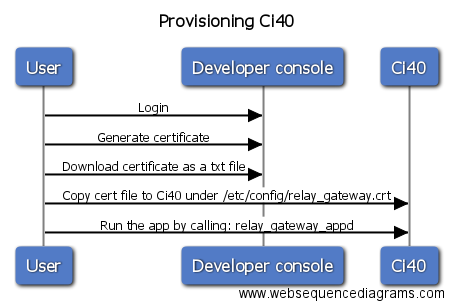
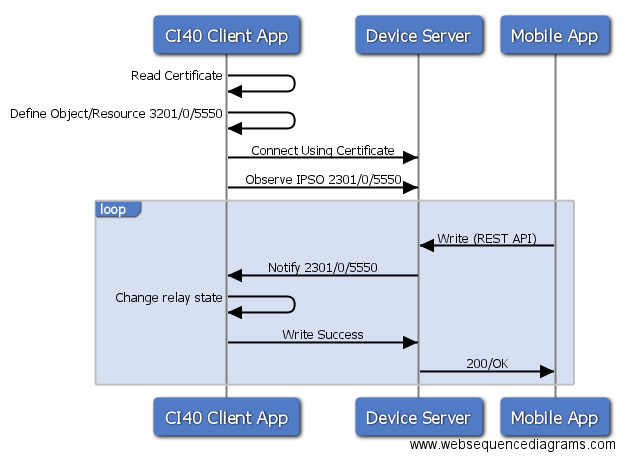

# Relay gateway application

## Overview
Relay gateway application runs on Ci40 board with Relay click inserted in click interface. It acts as AwaL2MWM client and connects to **Creator Device Server**.

The device server is a LWM2M management server designed to be implemented alongside third party cloud services to integrate M2M capability into an IoT application. The device server exposes two secure interfaces; REST API/HTTPs and LWM2M/CoAP.

Relay gateway app defines IPSO 3201 (DigitalOutput) object and subscribes to it's resource 5550 (DigitalOutputState) change.
Mobile app can control that resource by sending request to Device Server using REST API.
Upon message receipt Ci40 app is changing relay state according to current IPSO resource value.

Relay gateway application serves the purpose of:
- It acts as Awalwm2m client
- It communicates with device server

| Object Name       | Object ID      | Resource Name       | Resource ID |
| :----             | :--------------| :-------------------| :-----------|
| RelayDevice       | 3201           | DigitalOutputState  | 5550        |


## Prerequisites
### Hardware
Relay click should be inserted on Ci40 in Mikrobus slot 1.

### App provisioning
Application needs valid certificate to communicate with Creator Device Server. Process of providing certificate for the app is called *provisioning*.

You can obtain certificate by logging to creator developer console and selecting Identities > Certificates > Get Certificate. Then copy this certificate on Ci40
under
    /etc/config/relay_gateway.crt

<br>
This process is shown on image below

 

### Bootstrap URL
App needs to know where your bootstrap server is. Put your bootstrap URL in application config file that can be found under
    /etc/config/relay_gateway.cfg

## Application flow diagram


## Using OpenWrt SDK to build standalone package

Please refer [OpenWrt-SDK-build-instructions](https://github.com/CreatorKit/openwrt-ckt-feeds#building-creatorkit-packages-using-pre-compiled-openwrt-sdk-for-ci40-marduk) for exact build instructions.


## Running Application on Ci40 board
Relay gateway application can be started from the command line as:

$ relay_gateway_appd

Output looks something similar to this :

Relay Gateway Application
```
------------------------

Looking for certificate file under : /etc/config/relay_gateway.crt

Certificate found.


Observing IPSO object on path /3201/0/5550


Value of resource /3201/0/5550 changed to: 1

Changed relay state on Ci40 board to 1


Value of resource /3201/0/5550 changed to: 0

Changed relay state on Ci40 board to 0

```
